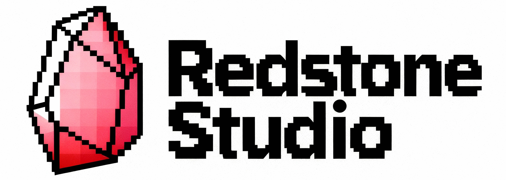

 

# 🔴 Redstone Studio

**The first visual programming IDE designed specifically for Minecraft addon development**

---

## 🚧 Early Development

Redstone Studio is currently in active development. Features and APIs may change. **Star ⭐ this repo to follow progress!**

---

## What is Redstone Studio?

Redstone Studio revolutionizes Minecraft addon development by providing the first visual programming system that speaks Minecraft's native languages - MoLang, Component Groups, Entity Events, and Animation Controllers.

---

## The Problem

- Current tools force generic programming concepts onto Minecraft's unique systems
- Beginners struggle with complex JSON structures and programming concepts  
- Existing visual tools generate poor quality, hard-to-maintain code
- Workflow is fragmented across multiple applications (Blockbench, MCreator, code editors)

## The Solution

Redstone Studio provides Blueprint visual programming designed specifically for Minecraft:

- **Native Minecraft Nodes** - Work directly with MoLang expressions, Component Groups, and Entity Events
- **Perfect Code Generation** - Outputs clean, professional Minecraft addon files
- **Integrated Workflow** - Model editor, animator, and Blueprint system in one application
- **Beginner to Expert** - Visual for newcomers, powerful for professionals

---

## Getting Started

### Technology Stack

- **Framework:** Kotlin Multiplatform with Compose Multiplatform
- **3D Rendering:** Korender for cross-platform OpenGL rendering
- **Platform:** Desktop-first (Windows, macOS, Linux)
- **Target Output:** Minecraft Bedrock Edition behavior/resource packs

---

## Contributing

We're building Redstone Studio with the Minecraft community! Here's how you can help:

- **Core Development** - Help build the Blueprint system, UI, or code generation
- **Minecraft Expertise** - Validate that generated addons follow best practices
- **Testing** - Try development builds and report bugs/feedback
- **Feature Requests** - Tell us what addon creation features you need most

---

## License

**Coming soon** - License details will be announced as the project nears its first stable release.  

---

## Community & Support

- **Issues:** [GitHub Issues](https://github.com/TAbhishekkumar6/redstone-studio/issues)
- **Discussions:** [GitHub Discussions](https://github.com/TAbhishekkumar6/redstone-studio/discussions)
- **Discord:** Coming soon
- **Documentation:** Coming soon

---

**Star ⭐ this repo if you're excited about the future of visual Minecraft addon development!**

*Made with ❤️ for the Minecraft community*

---

*Redstone Studio is not affiliated with or endorsed by Mojang Studios or Microsoft.*
